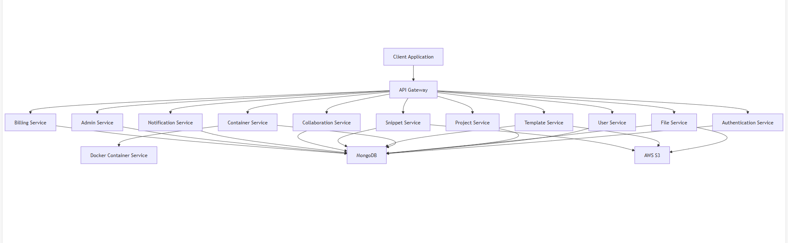

## CodeIDE Platform - Backend Documentation

## Table of Contents

1. [Introduction](#1-introduction)
2. [Project Architecture](#2-project-architecture)
3. [Entity Relationship Diagram](#3-entity-relationship-diagram)
4. [API Documentation](#4-api-documentation)
5. [Service Architecture](#5-service-architecture)

---

## 1. Introduction

### 1.1 Overview

The CodeIDE Platform is a comprehensive web-based integrated development environment that enables developers to write, run, and debug code directly in their browsers. This platform eliminates the need for local development environments, allowing developers to code from any device with internet access.

### 1.2 Purpose and Goals

The primary purpose of the CodeIDE Platform is to provide a seamless, collaborative coding experience with the following goals:

- **Accessibility**: Enable coding from any device without setup requirements
- **Collaboration**: Facilitate real-time collaboration between developers
- **Integration**: Provide seamless integration with version control and deployment tools
- **Scalability**: Support projects of varying sizes and complexity
- **Security**: Ensure code and data security throughout the platform

### 1.3 Key Features

The backend system supports the following key features:

- **Project Management**: Create, manage, and organize coding projects
- **File Management**: Edit, version, and organize project files
- **Container Execution**: Run code in isolated containers with terminal access
- **Real-time Collaboration**: Collaborate with team members in real-time
- **Template System**: Start projects from pre-configured templates
- **Snippet Library**: Create and share reusable code snippets
- **User Management**: Manage user accounts, roles, and permissions
- **Subscription Management**: Handle different subscription tiers and billing

### 1.4 Technology Stack

The backend system is built using the following technologies:

- **Runtime**: Node.js
- **Framework**: Express.js
- **Database**: MongoDB
- **Storage**: AWS S3
- **Containerization**: Docker
- **Real-time Communication**: Socket.IO
- **Authentication**: JWT (JSON Web Tokens)
- **API Design**: RESTful API with JSON

### 1.5 System Boundaries

The backend system interfaces with:

- **Frontend Application**: Web-based user interface
- **External Services**: GitHub, OAuth providers, payment processors
- **Infrastructure**: AWS services, Docker containers

---

## 2. Project Architecture

### 2.1 System Overview

The CodeIDE platform is a web-based integrated development environment that allows developers to write, run, and debug code directly in the browser. The system provides project management, file editing, terminal access, and real-time collaboration features.

### 2.2 Backend Architecture Diagram

### 2.3 Code Execution Architecture Diagram

### 2.4 Technology Stack

- **Backend Framework**: Node.js with Express
- **Database**: MongoDB
- **File Storage**: AWS S3
- **Container Orchestration**: Docker
- **Real-time Communication**: Socket.IO
- **Authentication**: JWT (JSON Web Tokens)
- **API Design**: RESTful API with JSON

### 2.5 Service Organization

The backend is organized into domain-specific microservices:

1. **Authentication Service**: Handles user authentication and authorization
2. **User Service**: Manages user profiles and preferences
3. **Project Service**: Handles project creation and management
4. **File Service**: Manages file operations and storage
5. **Container Service**: Orchestrates Docker containers for code execution
6. **Template Service**: Manages project templates
7. **Snippet Service**: Handles code snippets
8. **Collaboration Service**: Manages real-time collaboration
9. **Notification Service**: Handles system notifications
10. **Admin Service**: Provides administrative capabilities
11. **Billing Service**: Manages subscriptions and payments

---

## 3. Entity Relationship Diagram

---

## 4. API Documentation

### 1. Authentication API

| Endpoint                             | Method | Description                                   |
| ------------------------------------ | ------ | --------------------------------------------- |
| `/api/auth/register`                 | POST   | Creates a new user account                    |
| `/api/auth/login`                    | POST   | Authenticates a user and returns tokens       |
| `/api/auth/refresh-token`            | POST   | Issues a new access token using refresh token |
| `/api/auth/logout`                   | POST   | Invalidates tokens                            |
| `/api/auth/forgot-password`          | POST   | Sends password reset email                    |
| `/api/auth/reset-password`           | POST   | Resets password using token                   |
| `/api/auth/verify-email`             | POST   | Verifies user email                           |
| `/api/auth/oauth/:provider`          | GET    | Initiates OAuth login flow (GitHub, Google)   |
| `/api/auth/oauth/:provider/callback` | GET    | Handles OAuth callback                        |
| `/api/auth/me`                       | GET    | Returns current authenticated user            |

### 2. User API

| Endpoint                    | Method | Description                          |
| --------------------------- | ------ | ------------------------------------ |
| `/api/users/me`             | GET    | Returns authenticated user's profile |
| `/api/users/me`             | PATCH  | Updates user profile                 |
| `/api/users/me/password`    | PUT    | Changes user password                |
| `/api/users/me/avatar`      | POST   | Uploads user avatar                  |
| `/api/users/me/preferences` | PATCH  | Updates user preferences             |
| `/api/users/me/activity`    | GET    | Returns user activity history        |
| `/api/users/:id`            | GET    | Returns public user profile          |
| `/api/users/search`         | GET    | Searches for users                   |

### 3. Project API

| Endpoint                          | Method | Description                     |
| --------------------------------- | ------ | ------------------------------- |
| `/api/projects`                   | POST   | Creates a new project           |
| `/api/projects`                   | GET    | Returns user's projects         |
| `/api/projects/:id`               | GET    | Returns project details         |
| `/api/projects/:id`               | PATCH  | Updates project details         |
| `/api/projects/:id`               | DELETE | Deletes a project               |
| `/api/projects/recent`            | GET    | Gets recently accessed projects |
| `/api/projects/:id/settings`      | GET    | Gets project settings           |
| `/api/projects/:id/settings`      | PUT    | Updates project settings        |
| `/api/projects/:id/collaborators` | GET    | Gets project collaborators      |
| `/api/projects/:id/activity`      | GET    | Gets project activity log       |

### 4. File API

| Endpoint                                  | Method | Description                        |
| ----------------------------------------- | ------ | ---------------------------------- |
| `/api/projects/:projectId/files`          | GET    | Lists files in a project           |
| `/api/projects/:projectId/files/content`  | GET    | Returns file content               |
| `/api/projects/:projectId/files`          | POST   | Creates a new file                 |
| `/api/projects/:projectId/files/content`  | PUT    | Updates file content               |
| `/api/projects/:projectId/files`          | DELETE | Deletes a file                     |
| `/api/projects/:projectId/files/rename`   | POST   | Renames a file or directory        |
| `/api/projects/:projectId/files/history`  | GET    | Returns file version history       |
| `/api/projects/:projectId/files/version`  | GET    | Returns specific file version      |
| `/api/projects/:projectId/files/search`   | GET    | Searches for files in project      |
| `/api/projects/:projectId/files/upload`   | POST   | Uploads files to project           |
| `/api/projects/:projectId/files/download` | GET    | Downloads file or directory as zip |
| `/api/projects/:projectId/files/move`     | POST   | Moves files or directories         |
| `/api/projects/:projectId/files/copy`     | POST   | Copies files or directories        |

### 5. Code Execution API

| Endpoint                                             | Method    | Description                                       |
| ---------------------------------------------------- | --------- | ------------------------------------------------- |
| `/api/projects/:projectId/execute`                   | POST      | Executes code in the project                      |
| `/api/projects/:projectId/execute/status`            | GET       | Gets status of code execution                     |
| `/api/projects/:projectId/execute/stop`              | POST      | Stops code execution                              |
| `/api/projects/:projectId/execute/logs`              | GET       | Gets execution logs                               |
| `/api/projects/:projectId/execute/terminal`          | WebSocket | WebSocket endpoint for interactive terminal       |
| `/api/projects/:projectId/execute/output`            | WebSocket | WebSocket endpoint for real-time execution output |
| `/api/projects/:projectId/execute/debug`             | POST      | Starts debugging session                          |
| `/api/projects/:projectId/execute/debug/breakpoints` | POST      | Sets breakpoints for debugging                    |
| `/api/projects/:projectId/execute/debug/continue`    | POST      | Continues execution in debug mode                 |
| `/api/projects/:projectId/execute/debug/step`        | POST      | Steps through code in debug mode                  |
| `/api/projects/:projectId/execute/debug/variables`   | GET       | Gets variable values during debugging             |
| `/api/projects/:projectId/execute/debug/stop`        | POST      | Stops debugging session                           |
| `/api/projects/:projectId/build`                     | POST      | Builds the project                                |
| `/api/projects/:projectId/build/status`              | GET       | Gets build status                                 |
| `/api/projects/:projectId/build/logs`                | GET       | Gets build logs                                   |

### 6. Template API

| Endpoint                    | Method | Description                        |
| --------------------------- | ------ | ---------------------------------- |
| `/api/templates`            | GET    | Returns available templates        |
| `/api/templates/:id`        | GET    | Returns template details           |
| `/api/templates/:id/files`  | GET    | Returns template file content      |
| `/api/templates/categories` | GET    | Gets template categories           |
| `/api/templates/featured`   | GET    | Gets featured templates            |
| `/api/templates/search`     | GET    | Searches for templates             |
| `/api/templates/languages`  | GET    | Gets available template languages  |
| `/api/templates/frameworks` | GET    | Gets available template frameworks |

### 7. Snippet API

| Endpoint                                | Method | Description                      |
| --------------------------------------- | ------ | -------------------------------- |
| `/api/snippets`                         | POST   | Creates a new snippet            |
| `/api/snippets`                         | GET    | Returns available snippets       |
| `/api/snippets/:id`                     | GET    | Returns snippet details          |
| `/api/snippets/:id`                     | PATCH  | Updates a snippet                |
| `/api/snippets/:id`                     | DELETE | Deletes a snippet                |
| `/api/snippets/:id/comments`            | GET    | Returns snippet comments         |
| `/api/snippets/:id/comments`            | POST   | Adds a comment to a snippet      |
| `/api/snippets/:id/comments/:commentId` | PATCH  | Updates a comment                |
| `/api/snippets/:id/comments/:commentId` | DELETE | Deletes a comment                |
| `/api/snippets/search`                  | GET    | Searches for snippets            |
| `/api/snippets/languages`               | GET    | Gets available snippet languages |
| `/api/snippets/tags`                    | GET    | Gets popular snippet tags        |
| `/api/snippets/my`                      | GET    | Gets user's snippets             |
| `/api/snippets/featured`                | GET    | Gets featured snippets           |

### 8. Collaboration API

| Endpoint                                                | Method    | Description                                    |
| ------------------------------------------------------- | --------- | ---------------------------------------------- |
| `/api/projects/:projectId/collaborators`                | GET       | Returns project collaborators                  |
| `/api/projects/:projectId/collaborators`                | POST      | Adds a collaborator                            |
| `/api/projects/:projectId/collaborators/:userId`        | PATCH     | Updates collaborator permissions               |
| `/api/projects/:projectId/collaborators/:userId`        | DELETE    | Removes a collaborator                         |
| `/api/collaborations/invitations/:invitationId/accept`  | POST      | Accepts a collaboration invitation             |
| `/api/collaborations/invitations/:invitationId/decline` | POST      | Declines a collaboration invitation            |
| `/api/collaborations/invitations`                       | GET       | Returns user's collaboration invitations       |
| `/api/collaborations/sessions/:projectId`               | POST      | Creates a collaboration session                |
| `/api/collaborations/sessions/:sessionId`               | GET       | Gets collaboration session details             |
| `/api/collaborations/sessions/:sessionId/join`          | POST      | Joins a collaboration session                  |
| `/api/collaborations/sessions/:sessionId/leave`         | POST      | Leaves a collaboration session                 |
| `/api/ws/collaboration/:sessionId`                      | WebSocket | WebSocket endpoint for real-time collaboration |

### 9. Notification API

| Endpoint                          | Method    | Description                                    |
| --------------------------------- | --------- | ---------------------------------------------- |
| `/api/notifications`              | GET       | Returns user notifications                     |
| `/api/notifications/:id/read`     | POST      | Marks a notification as read                   |
| `/api/notifications/read-all`     | POST      | Marks all notifications as read                |
| `/api/notifications/:id`          | DELETE    | Deletes a notification                         |
| `/api/notifications/settings`     | GET       | Gets notification settings                     |
| `/api/notifications/settings`     | PUT       | Updates notification settings                  |
| `/api/notifications/unread-count` | GET       | Gets count of unread notifications             |
| `/api/ws/notifications`           | WebSocket | WebSocket endpoint for real-time notifications |

### 10. Admin API

| Endpoint                            | Method | Description                       |
| ----------------------------------- | ------ | --------------------------------- |
| `/api/admin/users`                  | GET    | Returns all users                 |
| `/api/admin/users/:id`              | GET    | Returns detailed user information |
| `/api/admin/users/:id`              | PATCH  | Updates user details              |
| `/api/admin/users/:id`              | DELETE | Deletes a user                    |
| `/api/admin/stats`                  | GET    | Returns system statistics         |
| `/api/admin/projects`               | GET    | Returns all projects              |
| `/api/admin/projects/:id`           | GET    | Gets detailed project information |
| `/api/admin/projects/:id`           | DELETE | Deletes a project                 |
| `/api/admin/subscription-plans`     | GET    | Returns all subscription plans    |
| `/api/admin/subscription-plans`     | POST   | Creates a new subscription plan   |
| `/api/admin/subscription-plans/:id` | PATCH  | Updates a subscription plan       |
| `/api/admin/templates`              | POST   | Creates a new template            |
| `/api/admin/templates/:id/files`    | POST   | Uploads template files            |
| `/api/admin/templates/:id`          | PATCH  | Updates template details          |
| `/api/admin/templates/:id`          | DELETE | Deletes a template                |
| `/api/admin/logs`                   | GET    | Gets system logs                  |
| `/api/admin/settings`               | GET    | Gets system settings              |
| `/api/admin/settings`               | PUT    | Updates system settings           |

### 11. Billing API

| Endpoint                              | Method | Description                          |
| ------------------------------------- | ------ | ------------------------------------ |
| `/api/billing/subscription`           | GET    | Returns user's subscription          |
| `/api/billing/plans`                  | GET    | Returns available subscription plans |
| `/api/billing/subscribe`              | POST   | Subscribes to a plan                 |
| `/api/billing/subscription/cancel`    | POST   | Cancels subscription                 |
| `/api/billing/payment-method`         | GET    | Gets payment methods                 |
| `/api/billing/payment-method`         | POST   | Adds a payment method                |
| `/api/billing/payment-method`         | PUT    | Updates payment method               |
| `/api/billing/payment-method/:id`     | DELETE | Removes a payment method             |
| `/api/billing/invoices`               | GET    | Returns user's invoices              |
| `/api/billing/usage`                  | GET    | Gets current resource usage          |
| `/api/billing/subscription/upgrade`   | POST   | Upgrades subscription                |
| `/api/billing/subscription/downgrade` | POST   | Downgrades subscription              |

### 12. Editor API

| Endpoint                       | Method | Description                      |
| ------------------------------ | ------ | -------------------------------- |
| `/api/editor/settings`         | GET    | Gets editor settings             |
| `/api/editor/settings`         | PUT    | Updates editor settings          |
| `/api/editor/themes`           | GET    | Gets available editor themes     |
| `/api/editor/keymaps`          | GET    | Gets available keymaps           |
| `/api/editor/extensions`       | GET    | Gets available extensions        |
| `/api/editor/extensions/:id`   | POST   | Installs an extension            |
| `/api/editor/extensions/:id`   | DELETE | Uninstalls an extension          |
| `/api/editor/snippets`         | GET    | Gets code snippets for editor    |
| `/api/editor/snippets`         | POST   | Creates a code snippet           |
| `/api/editor/snippets/:id`     | DELETE | Deletes a code snippet           |
| `/api/editor/state/:projectId` | GET    | Gets editor state for a project  |
| `/api/editor/state/:projectId` | PUT    | Saves editor state for a project |

### 13. Dashboard API

| Endpoint                        | Method | Description                        |
| ------------------------------- | ------ | ---------------------------------- |
| `/api/dashboard/stats`          | GET    | Gets user dashboard statistics     |
| `/api/dashboard/activity`       | GET    | Gets recent activity for dashboard |
| `/api/dashboard/projects`       | GET    | Gets projects for dashboard        |
| `/api/dashboard/snippets`       | GET    | Gets snippets for dashboard        |
| `/api/dashboard/collaborations` | GET    | Gets collaborations for dashboard  |

### 14. Settings API

| Endpoint                      | Method | Description                   |
| ----------------------------- | ------ | ----------------------------- |
| `/api/settings/profile`       | GET    | Gets profile settings         |
| `/api/settings/profile`       | PUT    | Updates profile settings      |
| `/api/settings/security`      | GET    | Gets security settings        |
| `/api/settings/security`      | PUT    | Updates security settings     |
| `/api/settings/notifications` | GET    | Gets notification settings    |
| `/api/settings/notifications` | PUT    | Updates notification settings |
| `/api/settings/billing`       | GET    | Gets billing settings         |
| `/api/settings/appearance`    | GET    | Gets appearance settings      |
| `/api/settings/appearance`    | PUT    | Updates appearance settings   |
| `/api/settings/api-keys`      | GET    | Gets API keys                 |
| `/api/settings/api-keys`      | POST   | Creates an API key            |
| `/api/settings/api-keys/:id`  | DELETE | Deletes an API key            |
| `/api/settings/editor`        | GET    | Gets editor settings          |
| `/api/settings/editor`        | PUT    | Updates editor settings       |

### 15. File System API

| Endpoint                                | Method | Description                             |
| --------------------------------------- | ------ | --------------------------------------- |
| `/api/fs/projects/:projectId/files`     | GET    | Lists files with detailed metadata      |
| `/api/fs/projects/:projectId/directory` | POST   | Creates a new directory                 |
| `/api/fs/projects/:projectId/zip`       | POST   | Creates a zip archive of files          |
| `/api/fs/projects/:projectId/unzip`     | POST   | Extracts a zip archive                  |
| `/api/fs/projects/:projectId/import`    | POST   | Imports files from URL or GitHub        |
| `/api/fs/projects/:projectId/export`    | GET    | Exports project as downloadable archive |
| `/api/fs/projects/:projectId/stats`     | GET    | Gets file system statistics             |

## 5. Service Architecture

### 5.1 Authentication Service

The Authentication Service handles user authentication and authorization:

- **Responsibilities**:

- User registration and login
- Token generation and validation
- Password reset and email verification
- OAuth integration
- Session management

- **Implementation**:

- JWT-based authentication
- Secure password hashing with bcrypt
- Token-based refresh mechanism
- Role-based access control

- **Key Components**:

- AuthController: Handles authentication requests
- TokenService: Manages JWT tokens
- PasswordService: Handles password operations
- OAuthService: Manages OAuth providers

### 5.2 User Service

The User Service manages user profiles and preferences:

- **Responsibilities**:

- User profile management
- User preferences
- Avatar handling
- Activity tracking

- **Implementation**:

- RESTful API for user operations
- S3 integration for avatar storage
- Preference serialization and validation

- **Key Components**:

- UserController: Handles user requests
- ProfileService: Manages user profiles
- PreferenceService: Handles user preferences
- ActivityService: Tracks user activity

### 5.3 Project Service

The Project Service handles project creation and management:

- **Responsibilities**:

- Project CRUD operations
- Project metadata management
- Collaboration settings
- Project statistics

- **Implementation**:

- RESTful API for project operations
- Permission checking middleware
- Project template instantiation

- **Key Components**:

- ProjectController: Handles project requests
- ProjectService: Manages project operations
- CollaborationService: Handles project sharing
- TemplateService: Manages project templates

### 5.4 File Service

The File Service manages file operations and storage:

- **Responsibilities**:

- File CRUD operations
- Directory management
- File versioning
- File search

- **Implementation**:

- S3 integration for file storage
- Path-based file organization
- Versioning with S3 object versioning
- MIME type detection

- **Key Components**:

- FileController: Handles file requests
- FileService: Manages file operations
- S3Service: Handles S3 interactions
- VersionService: Manages file versions

### 5.5 Container Service

The Container Service orchestrates Docker containers for code execution:

- **Responsibilities**:

- Container provisioning
- Container lifecycle management
- Code execution
- Terminal access

- **Implementation**:

- Docker API integration
- Container resource management
- WebSocket for terminal access
- Container health monitoring

- **Key Components**:

- ContainerController: Handles container requests
- ContainerService: Manages container operations
- DockerService: Handles Docker API interactions
- TerminalService: Manages terminal sessions

### 5.6 Template Service

The Template Service manages project templates:

- **Responsibilities**:

- Template CRUD operations
- Template discovery
- Template instantiation
- Template versioning

- **Implementation**:

- S3 integration for template storage
- Template metadata management
- Template file organization

- **Key Components**:

- TemplateController: Handles template requests
- TemplateService: Manages template operations
- TemplateFileService: Handles template files
- S3Service: Manages template storage

### 5.7 Snippet Service

The Snippet Service handles code snippets:

- **Responsibilities**:

- Snippet CRUD operations
- Snippet sharing
- Snippet discovery
- Snippet comments and likes

- **Implementation**:

- S3 integration for snippet storage
- Snippet metadata management
- Social features (likes, comments)

- **Key Components**:

- SnippetController: Handles snippet requests
- SnippetService: Manages snippet operations
- CommentService: Handles snippet comments
- LikeService: Manages snippet likes

### 5.8 Collaboration Service

The Collaboration Service manages real-time collaboration:

- **Responsibilities**:

- Real-time collaboration
- Presence tracking
- Operational transformation
- Collaboration history

- **Implementation**:

- Socket.IO for real-time communication
- Operational transformation for conflict resolution
- Room-based collaboration sessions

- **Key Components**:

- CollaborationController: Handles collaboration requests
- SocketService: Manages WebSocket connections
- OTService: Handles operational transformation
- PresenceService: Tracks user presence

### 5.9 Notification Service

The Notification Service handles system notifications:

- **Responsibilities**:

- System notifications
- Email notifications
- Real-time alerts
- Notification preferences

- **Implementation**:

- In-app notification system
- Email integration
- WebSocket for real-time notifications

- **Key Components**:

- NotificationController: Handles notification requests
- NotificationService: Manages notifications
- EmailService: Handles email notifications
- PreferenceService: Manages notification preferences

### 5.10 Admin Service

The Admin Service provides administrative capabilities:

- **Responsibilities**:

- User management
- System configuration
- Analytics and reporting
- Template management

- **Implementation**:

- Admin-only API endpoints
- Role-based access control
- System-wide operations

- **Key Components**:

- AdminController: Handles admin requests
- UserAdminService: Manages user administration
- SystemService: Handles system operations
- AnalyticsService: Provides system analytics

### 5.11 Billing Service

The Billing Service manages subscriptions and payments:

- **Responsibilities**:

- Subscription management
- Payment processing
- Usage tracking
- Invoice generation
- Subscription history

- **Implementation**:

- Integration with payment processors
- Subscription lifecycle management
- Usage metering and limits
- Automated billing

- **Key Components**:

- BillingController: Handles billing requests
- SubscriptionService: Manages subscriptions
- PaymentService: Handles payment processing
- UsageService: Tracks resource usage

---
